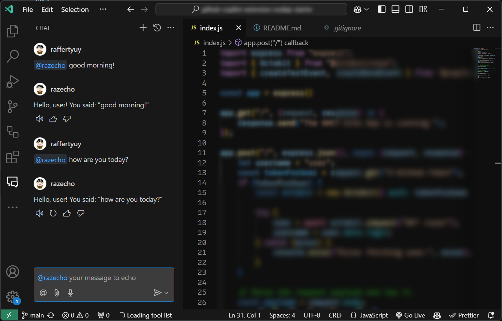
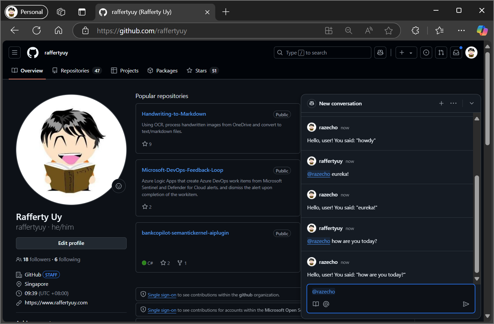
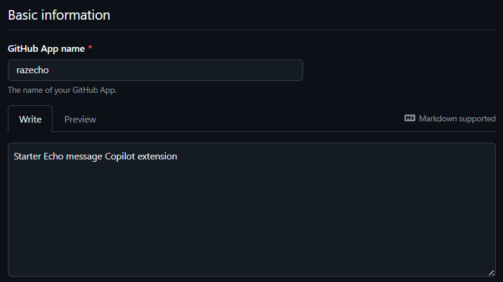
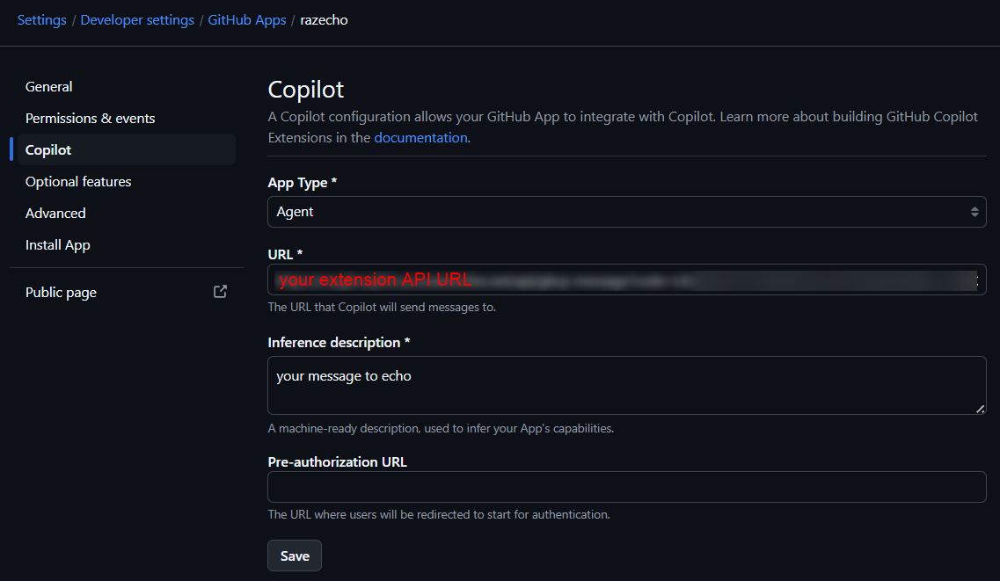

# github-copilot-extension-python-azfunction-starter

This is a simple GitHub Copilot Chat extension that simply echo's what you say.
This sample is developed using Python and is to be deployed in Azure Functions. If you're looking for a Node.js starter, check out [this repository](https://github.com/raffertyuy/github-copilot-extension-nodejs-azfunction-starter).




> [!TIP]
> This extension is inspired by the basic [tutorial video](https://youtu.be/ky5TMI9skLE) from @ambilykk. Do check it out!

## Running and Debugging Locally
**Pre-requisites:**
1. Azure Function Pre-requisites: check out the [official documentation](https://learn.microsoft.com/en-us/azure/azure-functions/create-first-function-vs-code-node?pivots=nodejs-model-v4)
2. GitHub Debug CLI: see [gh debug-cli](https://docs.github.com/en/copilot/building-copilot-extensions/debugging-your-github-copilot-extension)

**Run the app locally:**
```bash
cd az-function
python -m venv .venv
source .venv/bin/activate #if using Windows Command Prompt, run `.venv\Scripts\activate`
pip install -r requirements.txt

func start
```

**In a new terminal, use the `gh debug-cli`:**
```bash
export URL="http://localhost:7071/api/EchoMessage" #if using Windows Command Prompt, use `set` instead of `export`

gh debug-cli
```

## Deploying to Azure and Testing in GitHub.com
### Deploy the Azure Function
1. Open the project in VS Code
2. Sign in to Azure: `CTRL/Cmd + Shift + P` > `Azure: Sign In`
3. `CTRL/Cmd + Shift + P` > `Azure Functions: Deploy to Function App`

### Add a new GitHub App
1. Go to your _GitHub Profile → Settings → Developer settings → New GitHub App_
2. Fill in the some initial values:
  - the _GitHub App name_ is going to be the `@agentname` that you'll use in the GH Copilot Chat
  - for test purposes, you may disable/uncheck _"Request user authorization (OAuth) during installation"_
3. Click _Copilot_ from the navigation bar on the left
  - Change **App Type** to _Agent_
  - Change **URL** to the Function URL of your Azure Function
  - Change **Inference description** to the message you want your users to see on the chat box




### Test the Agent Extension
1. In GitHub.com, open the GitHub Copilot Chat window
2. Type your `@app-name Hi!` and hit **ENTER** (Note: The agent won't show up until you do this for the first time)
3. Start chatting!
